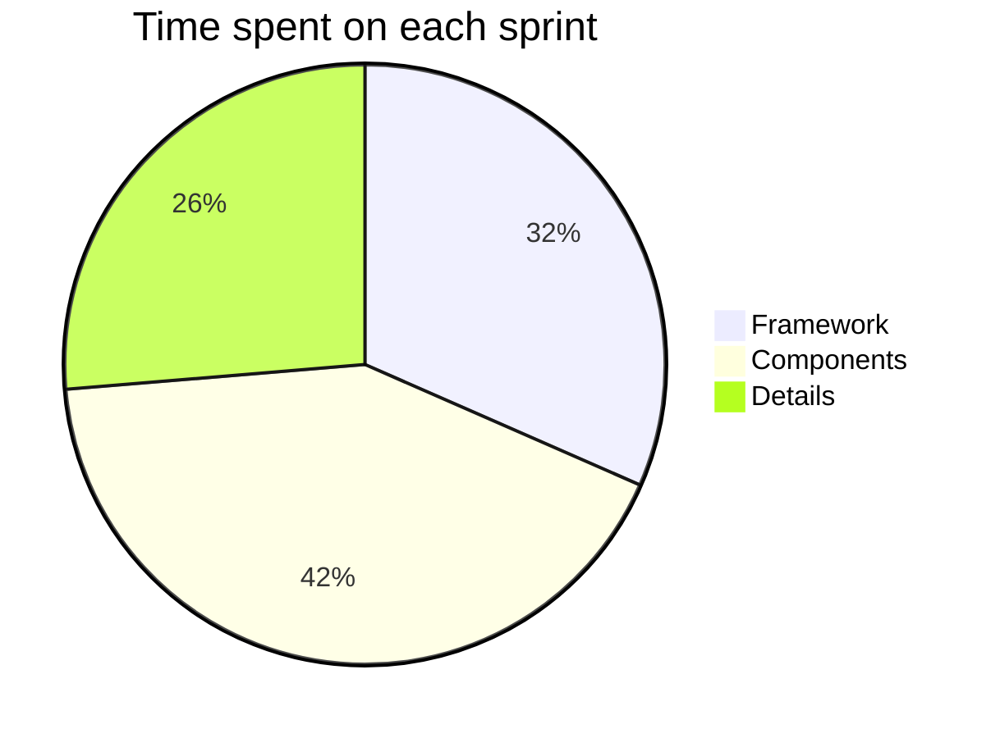
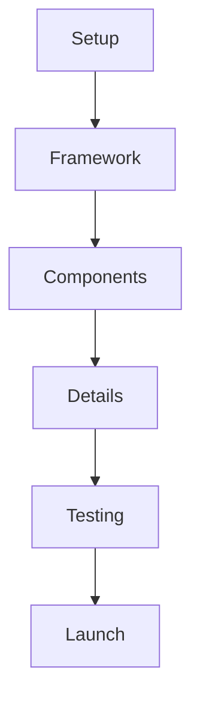
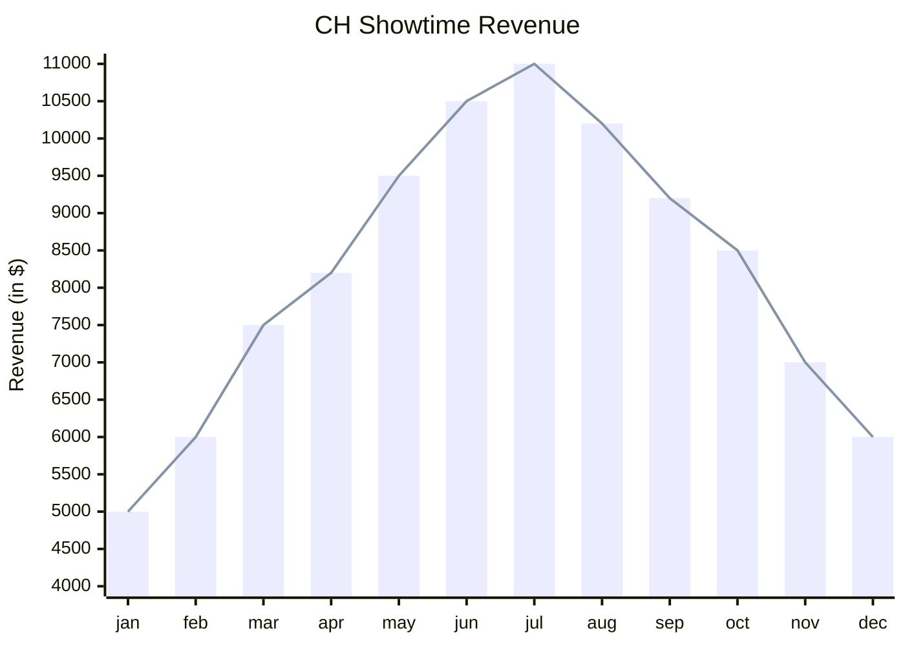

# CH Venue
Ticketing Website for CH Venue

**Link:** https://chvenue.netlify.app/

## Tech Used:

I wanted to use PHP to show my skills with developing for a CMS (and to not have hard-coded events, icons, images), but an index.html file was required.

**HTML**

**SASS/CSS**

**A mix of Vanilla Javascript & JQuery to show range**

**Bootstrap and non-Bootstrap solutions to show range**

**Hosted using Netlify**

# Mermaid Stuff!

 
 
 

 
 
 

 
 
 

